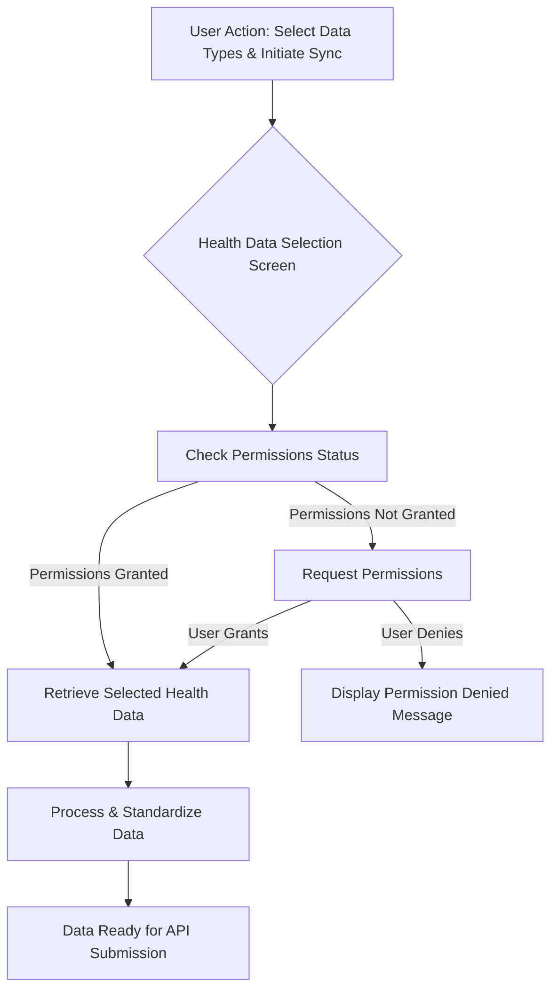

# Data Flow for SparkyFitnessMobile

This document outlines the detailed data flow within the SparkyFitnessMobile application, from user input and health data retrieval to API submission and error handling.

## 1. Overview of Data Flow
The application's data flow can be broadly categorized into three main phases:
1. **Configuration Management:** Handling user-defined server URL and API key.
2. **Health Data Acquisition:** Retrieving health data from device-specific health platforms.
3. **API Submission:** Sending processed health data to the user's server.

## 2. Configuration Management Data Flow

```mermaid
graph TD
    A[User Input: Server URL & API Key] --> B{Configuration Screen}
    B --> C[Validate Input]
    C -->|Valid| D[Save to Local Storage (e.g., AsyncStorage)]
    C -->|Invalid| E[Display Validation Error]
    D --> F[Configuration Saved Confirmation]
    F --> G[App State: Configuration Loaded]
```

**Detailed Steps:**
1. **User Input:** The user enters their server URL and API Key into the respective input fields on the Configuration Screen.
2. **Input Validation:**
    - **Server URL:** Basic validation to ensure it's a well-formed URL (e.g., starts with `http://` or `https://`, contains a domain).
    - **API Key:** Optional validation (e.g., minimum length, specific character set) depending on expected key format.
3. **Local Storage:** If inputs are valid, the `Server URL` and `API Key` are securely stored in the device's local storage (e.g., Expo's `AsyncStorage` or `expo-secure-store` for sensitive data).
4. **App State Update:** The application's global state is updated to reflect the saved configuration, making it accessible to other parts of the app.
5. **User Feedback:** A confirmation message (e.g., a toast notification) is displayed to the user indicating successful saving.
6. **Error Handling:** If validation fails, an appropriate error message is displayed to the user.

## 3. Health Data Acquisition Data Flow



**Detailed Steps:**
1. **User Action:** The user selects desired health data types (e.g., steps, heart rate) on the Health Data Selection Screen and taps "Sync Now".
2. **Permission Check:** The app first checks if the necessary health data permissions (Health Connect for Android, HealthKit for iOS) have been granted for the selected data types.
3. **Permission Request (if needed):**
    - If permissions are not granted, the app prompts the user to grant them.
    - If the user grants permissions, the flow proceeds to data retrieval.
    - If the user denies permissions, an informative message is displayed, and the sync process is halted for those data types.
4. **Data Retrieval:** The Health Data Module (using `expo-health-connect` or `expo-healthkit`) queries the respective health platform for the selected data types within a defined timeframe (e.g., last 24 hours, last week).
5. **Data Processing & Standardization:**
    - Raw data from Health Connect/HealthKit may vary in format. This step involves transforming the retrieved data into a consistent, standardized JSON structure suitable for the server API.
    - This might include unit conversions, aggregation, or filtering.
6. **Data Ready:** The processed data is now ready to be sent to the server.

## 4. API Submission Data Flow

```mermaid
graph TD
    A[Data Ready for API Submission] --> B{API Integration Module}
    B --> C[Retrieve Server URL & API Key from Local Storage]
    C --> D[Construct API Request (axios)]
    D --> E{Send Data to Server}
    E -->|Success (HTTP 2xx)| F[Update Last Synced Timestamp]
    E -->|Success (HTTP 2xx)| G[Display Success Message]
    E -->|Failure (HTTP 4xx/5xx, Network Error)| I[Handle API Error]
    I --> J[Display Error Message]
    J --> K[Log Error (for debugging)]
```

**Detailed Steps:**
1. **Initiate Submission:** The processed health data is passed to the API Integration Module.
2. **Retrieve Configuration:** The module retrieves the saved `Server URL` and `API Key` from local storage.
3. **Construct Request:** An HTTP POST request is constructed using `axios`.
    - **URL:** The retrieved Server URL.
    - **Headers:** The API Key is included in the `Authorization` header (e.g., `Bearer YOUR_API_KEY`) or another agreed-upon header.
    - **Body:** The standardized health data JSON.
4. **Send Data:** The `axios` client sends the request to the server.
5. **Response Handling:**
    - **Success (HTTP 2xx):**
        - The `Last Synced` timestamp is updated in local storage and displayed in the UI.
        - A success message is displayed to the user.
    - **Failure (HTTP 4xx, 5xx, Network Error):**
        - **Error Handling:** The error response is parsed to identify the type of error (e.g., invalid API key, server down, network unreachable).
        - **User Feedback:** An appropriate, user-friendly error message is displayed (e.g., "Failed to send data. Please check your server URL and API key.").
        - **Logging:** Detailed error information is logged to the console or a local log file for debugging purposes.

## 5. Error Handling Strategy
- **Network Errors:** Graceful handling of no internet connection or unreachable server.
- **API Errors:** Distinguish between client-side errors (e.g., invalid API key, malformed request) and server-side errors.
- **Permission Errors:** Clear messages when health data permissions are denied.
- **Data Retrieval Errors:** Handle cases where specific health data types cannot be retrieved.

## 6. Local Storage Usage
- **`expo-secure-store`:** Recommended for sensitive data like API Keys.
- **`AsyncStorage`:** Suitable for non-sensitive configuration like Server URL and selected data types.

## 7. Data Structure (Example)
The standardized JSON structure sent to the server could look like this:

```json
{
  "apiKey": "YOUR_API_KEY",
  "timestamp": "2025-07-23T10:00:00Z",
  "deviceInfo": {
    "platform": "ios" | "android",
    "model": "iPhone 15",
    "osVersion": "iOS 17.5"
  },
  "healthData": [
    {
      "type": "steps",
      "value": 10000,
      "unit": "count",
      "date": "2025-07-22T08:00:00Z"
    },
    {
      "type": "heartRate",
      "value": 75,
      "unit": "bpm",
      "date": "2025-07-22T09:30:00Z"
    },
    {
      "type": "activeEnergyBurned",
      "value": 500,
      "unit": "kcal",
      "date": "2025-07-22T10:00:00Z"
    }
  ]
}